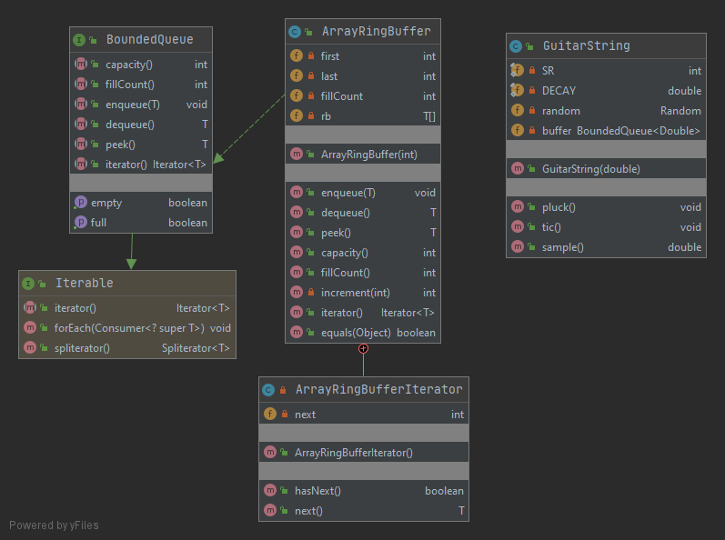
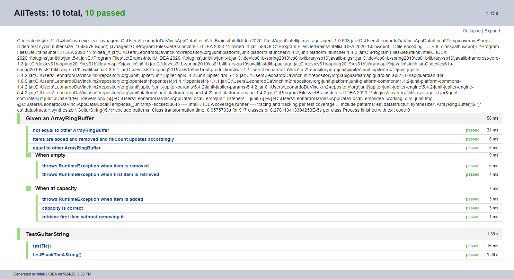
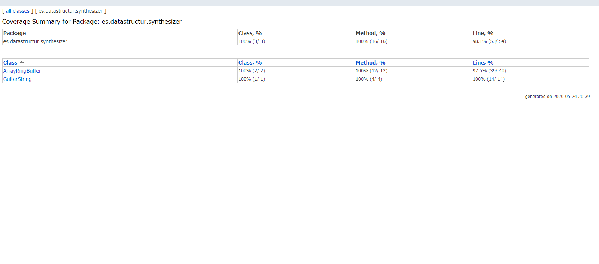

# [HW 1: Packages, Interfaces, Generics, Exceptions, Iteration](https://sp19.datastructur.es/materials/hw/hw1/hw1)

Conderns creating a package for generating synthesized musical instruments. 

Created the BoundedQueue Interface and the ArrayRingBuffer class that implements it. Implemented the Karplus-Algorithm 
in the GuitarString class using a BoundedQueue, i.e. GuitarString uses an ArrayRingBuffer to replicate the sound of a plucked string. 

## Run
Open in Intellij (I used Intellij IDEA 2020.1). 

To run a single test file, select the test file in the tests package, right click, and then select Run. This can also 
be done for the TTAF file.

To run all tests: 
- Select Run | Edit Configuration from the main menu.
- In the Run/Debug Configurations dialog, click the Add New Configuration button on the toolbar or press Alt+Insert.
- Select JUnit from the list.
- A new configuration page opens. Name this configuration.
- From the Test kind list, select "All in package".
- In the Package field type "tests".
- Apply the changes and close the dialog.
- Select Run.

## Files modified or created
- [BoundedQueue.java](es.datastructur.synthesizer/BoundedQueue.java)
- [ArrayRingBuffer.java](es.datastructur.synthesizer/ArrayRingBuffer.java)
- [GuitarString.java](es.datastructur.synthesizer/GuitarString.java)

BoundedQueue has a fixed capacity, and nothing is allowed to enqueue if the queue is full.
The ArrayRingBuffer implementation improves runtime compared to other considerations by
 using the ‘ring buffer’ data structure, which does not require shifting items when an item is removed.
Also, added the ability to iterate through a BoundedQueue, changed ArrayRingBuffer to throw exceptions
 when given invalid inputs, and finally overwrote the Object equals method to test the equality of two ArrayRingBuffers.
 
## Class Diagram

# Not included in the instructions, but I added

## Testing

### Junit 5
@Nested test classes are used to express the relationship among several groups of tests.

@TestMethodOrder and @Order are used to configure the test method execution order for some test classes.

@TestInstance(TestInstance.Lifecycle.PER_CLASS) is used when test methods rely on state stored in instance variables - i.e. when the sequence of the tests are dependent upon each other. Otherwise, the default setting instantiates a new test instance per test method.

@DisplayName is used on test classes and test methods to declare custom display names.

@BeforeEach is used to execute methods before each test.

@BeforeAll is used to execute methods before all tests.

Other annotations are also used.

### Code Coverage
Wrote tests such that almost all lines and branches are covered. Note: this does not mean the code is bug-free.

