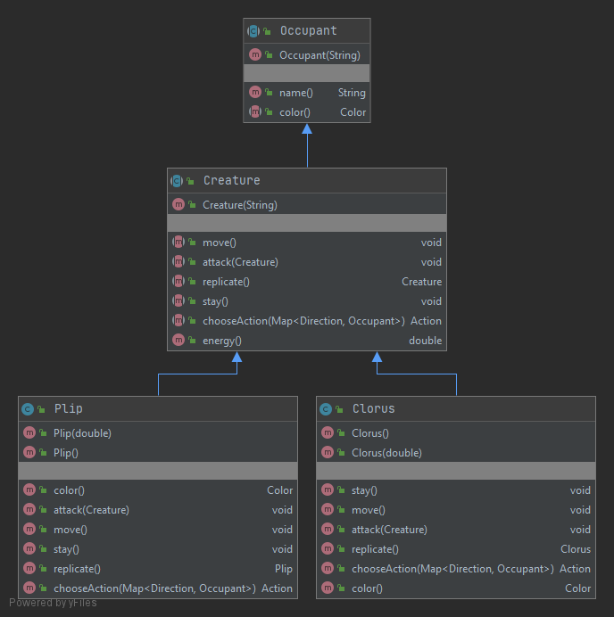
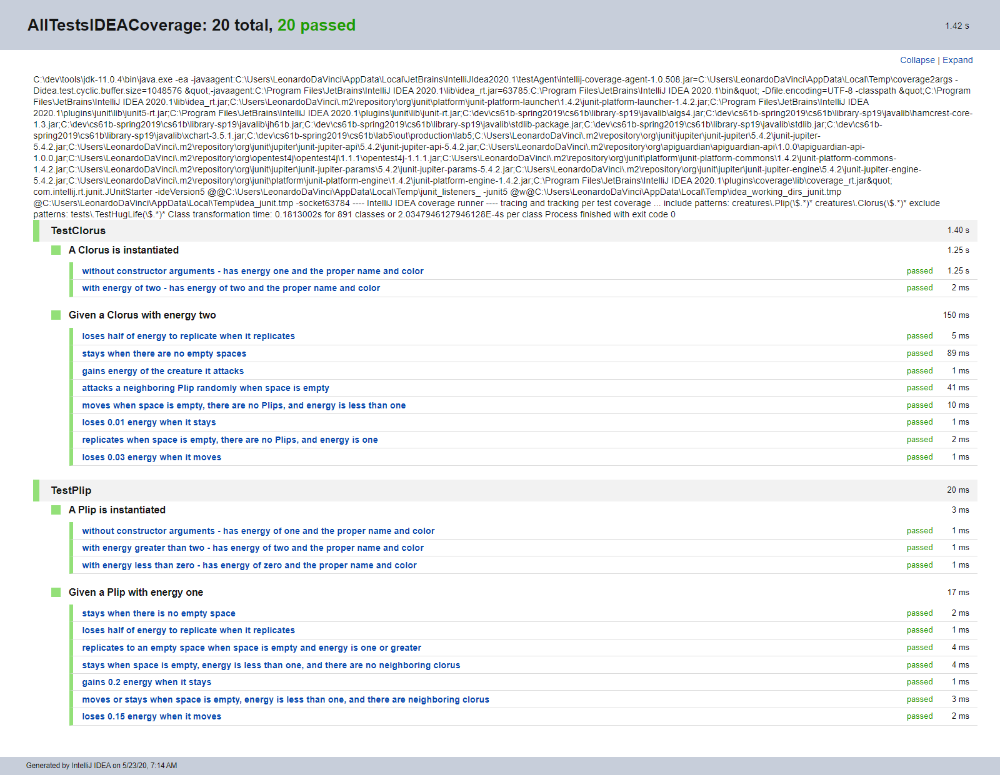
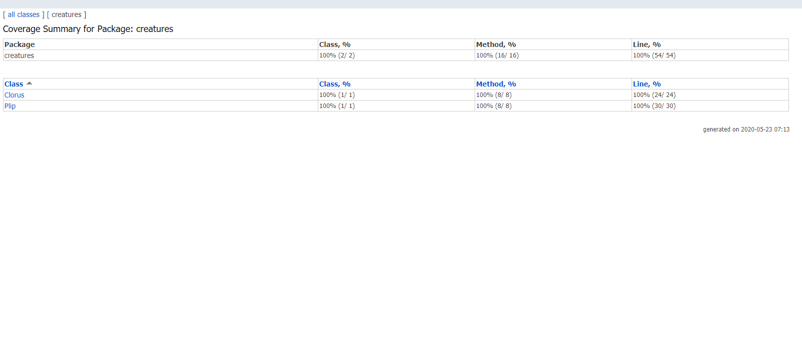

# [Lab 5: HugLife](https://sp19.datastructur.es/materials/lab/lab5/lab5)

Create two creatures that inhabit a world simulated by the huglife package (concerns Maps).

The skeleton code came with all classes in a single package that I reorganized into several different packages.

Test Driven Development was used to complete this assignment. 

## Run
Open in Intellij (I used Intellij IDEA 2020.1). 

To run the simulation: 
- Select Run | Edit Configuration from the main menu.
- In the Run/Debug Configurations dialog, click the Add New Configuration button on the toolbar or press Alt+Insert.
- Select Application from the list.
- A new configuration page opens. Name this configuration.
- In the Main class field, add huglife.HugLife
- In the Program arguments field, add strugggz
- Apply the changes and close the dialog.
- Select Run.

To run a single test file, select the test file in the tests package, right click, and then select Run
(TestHugLife.java file does nothing).

To run all tests: 
- Select Run | Edit Configuration from the main menu.
- In the Run/Debug Configurations dialog, click the Add New Configuration button on the toolbar or press Alt+Insert.
- Select JUnit from the list.
- A new configuration page opens. Name this configuration.
- From the Test kind list, select "All in package".
- In the Package field type "tests".
- Apply the changes and close the dialog.
- Select Run.

## Files created
- [Plip.java](creatures/Plip.java)
- [Clorus.java](creatures/Clorus.java)
- [TestClorus.java](tests/TestClorus.java)
- [TestPlip.java](tests/TestPlip.java)

## Class Diagram

## Testing

### Junit 5
@Nested test classes are used to express the relationship among several groups of tests.

@DisplayName is used on test classes and test methods to declare custom display names.

### Code Coverage
Wrote tests such that 100% code coverage is achieved.
100% code coverage does not mean the code works perfectly. One reason is that the tests may not be good enough to 
to find hidden bugs. Another
reason, is that only classes and their methods are being tested. Neither the interaction among different classes is 
being tested, nor the possible scenarios for using the application (i.e. use cases). These topics concern integration 
testing and beharior-driven development. 

## Tasks
- Create a [Deque](src/Deque.java) interface that contains all of the methods that appear in both ArrayDeque and - [LinkedListDeque](src/LinkedListDeque.java)
 (I already did this in project 1a).

- Create a [Palindrome](src/Palindrome.java) class that is used to create a [Deque](src/Deque.java) representation of a word and to check if a word is a palindrome. 

- Create a class called [OffByOne](src/OffByOne.java) that implements the [CharacterComparator](src/CharacterComparator.java) interface. [OffByOne](src/OffByOne.java) is used to determine if the difference between two 
chars is one (e.g, 'b'-'a' = 1). 

- Create a class called [OffByN](src/OffByN.java) that implements the [CharacterComparator](src/CharacterComparator.java) interface, where N is the difference between to chars (e.g, 'e'-'a' = 4, where N is 4). 

- Create the class called [PalindromeFinder](src/PalindromeFinder.java) that finds the most palindromes
in the file library-sp19/data/words.txt for all values of N and the longest palindrome in the words.txt.
