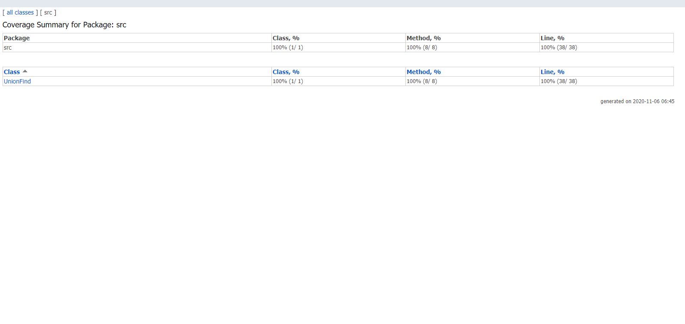

# [Lab 6: Disjoint Sets](https://sp19.datastructur.es/materials/lab/lab6/lab6)

Implemented the UnionFind class, which is a Weighted Quick Union that represents disjoint sets. 

A Test-Driven Development approach was taken.  

## Run
Open in Intellij (I used Intellij IDEA 2020.1). 

Select the test file in the tests package, right click, and then select Run.

## Files modified or created
- [UnionFind.java](src/UnionFind.java)
- [UnionFindTest.java](tests/UnionFindTest.java)

## Class Diagram

## Testing

### Junit 5
@Nested test classes are used to express the relationship among several groups of tests.

@TestMethodOrder and @Order are used to configure the test method execution order for some test classes.

@TestInstance(TestInstance.Lifecycle.PER_CLASS) is used when test methods rely on state stored in instance variables - i.e. when the sequence of the tests are dependent upon each other. Otherwise, the default setting instantiates a new test instance per test method.

@DisplayName is used on test classes and test methods to declare custom display names.

@BeforeEach is used to execute methods before each test.

@BeforeAll is used to execute methods before all tests.

Other annotations are also used.

### Code Coverage
Wrote tests such that all lines and branches are covered. Note: this does not mean that the implementation is bug-free. 

