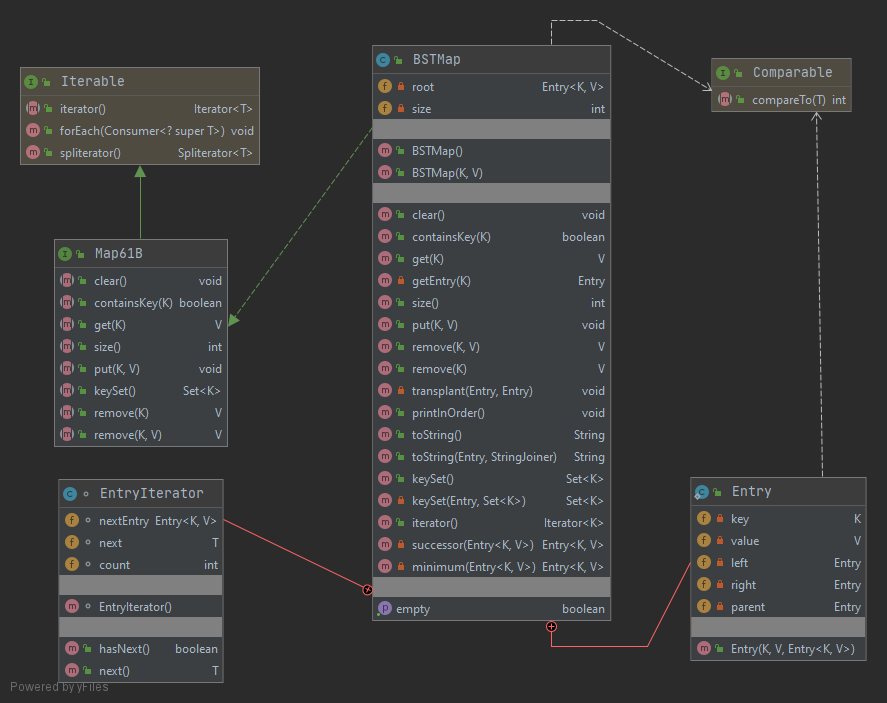
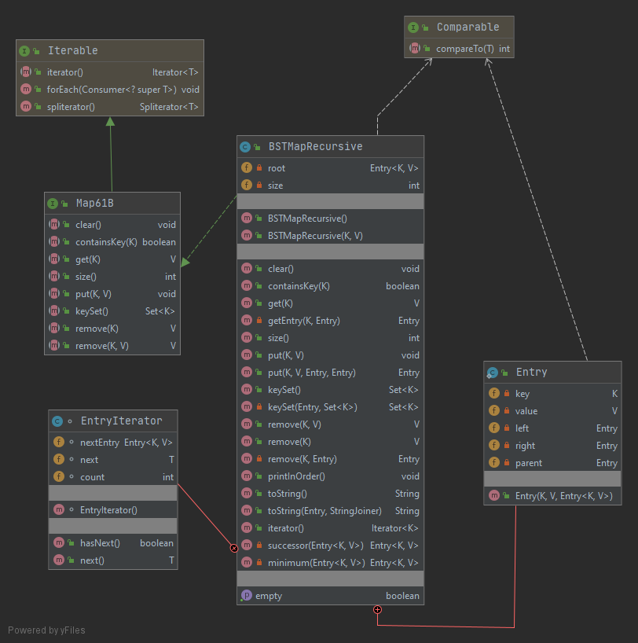
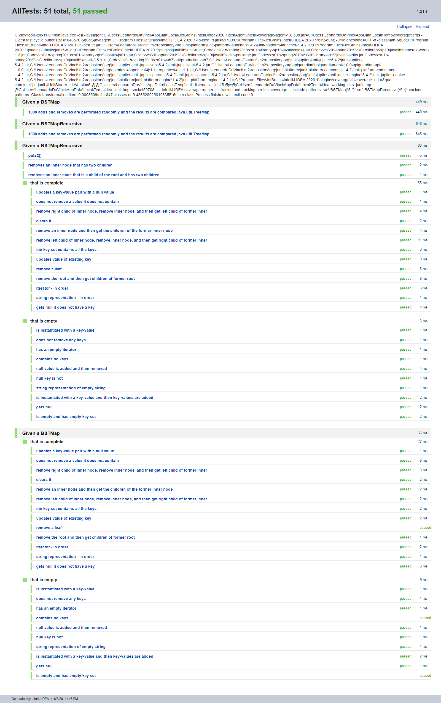
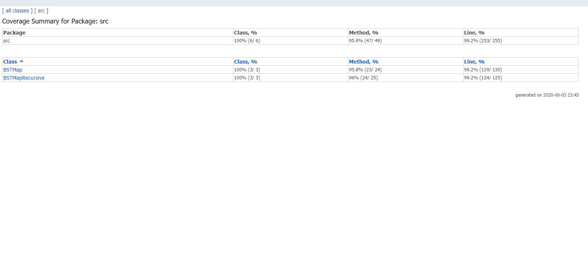
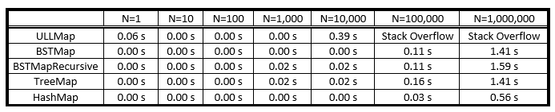
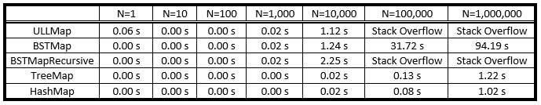

# [Lab 7: TreeMap](https://sp19.datastructur.es/materials/lab/lab7/lab7)
Created a [src.BSTMap](src/BSTMap.java), a BST-based implementation of the [src.Map61B](src/Map61B.java) interface, which represents a basic tree-based map. I also implemented [src.BSTMapRecursive](src/BSTMapRecursive.java) to compare its performance with other 

There are two interactive speed tests provided in [tests.InsertInOrderSpeedTest.java](tests/InsertInOrderSpeedTest.java) and [tests.InsertInOrderSpeedTest.java](tests/InsertInOrderSpeedTest.java). They were used to compare the performance of the implementations to a list-based Map implementation [src.ULLMap.java](src/ULLMap.java), the built-in Java [TreeMap](https://docs.oracle.com/javase/8/docs/api/java/util/TreeMap.html) class (which is a Red-Black BST), and the built-in Java [HashMap](https://docs.oracle.com/javase/8/docs/api/java/util/HashMap.html) class (which is a Hash table).

A Test-Driven Development approach was taken.

Implementations assume that generic keys K extend Comparable. Null keys are prohibited.

## Run
Open in Intellij (I used Intellij IDEA 2020.1). 

To run a single test file, select the test file in the tests package, right click, and then select Run.

To run all tests: 
- Select Run | Edit Configuration from the main menu.
- In the Run/Debug Configurations dialog, click the Add New Configuration button on the toolbar or press Alt+Insert.
- Select JUnit from the list.
- A new configuration page opens. Name this configuration.
- From the Test kind list, select "All in package".
- In the Package field type "tests".
- Apply the changes and close the dialog.
- Select Run.

## Files modified or created
- [BSTMap.java](src/BSTMap.java)
- [BSTMapTest.java](tests/map/BSTMapTest.java)
- [BSTMapRandomTest.java](tests/map/BSTMapRandomTest.java)

- [BSTMapRecursive.java](src/BSTMapRecursive.java)
- [BSTMapRecursiveTest.java](tests/map/BSTMapRecursiveTest.java)
- [BSTMapRecursiveRandomTest.java](tests/map/BSTMapRecursiveRandomTest.java)

## Class Diagram
BSTMap

BSTMapRecursive

## Testing
### Junit 5
Randomized tests implemented: items are added and removed randomly and the results are compared java.util.TreeMap.

@Nested test classes are used to express the relationship among several groups of tests.

@DisplayName is used on test classes and test methods to declare custom display names.

@BeforeEach is used to execute methods before each test.

@BeforeAll is used to execute methods before all tests.

Other annotations are also used.

### Code Coverage
Wrote tests such that all lines and branches are covered, except for the lines in the method printInOrder, which calls the toString method that is covered. Note: this does not mean that the implementation is bug-free. 

### Speed Tests

The InsertRandomSpeedTest class performs tests on element-insertion speed of the BSTMap, BSTMapRecursive, 
ULLMap (provided), Java’s built-in TreeMap (Red-Black BST), and Java’s built-in HashMap (Hash Table). It 
then generates N Strings of the specified length and inserts them into the maps as <String,Integer> pairs. The 
specified size of each inserted string is five, because that is approximately the average size of an English word.
Below are the results for the InsertRandomSpeedTest:

The InsertInOrderSpeedTest behaves similarly to InsertRandomSpeedTest, except the Strings in 
<String, Integer> key-value pairs are inserted in lexicographically-increasing order. Lexicographical order is 
a generalization of the way words are alphabetically ordered based on the alphabetical order of their component 
letters (e.g., 1, 10, 2 is in lexicographical order).

The ULL takes relatively longer and results in stack overflow due to storing all the mappings linearly (O(N)). Thus, the memory of the nodes exceeds the stack bound. Note, that its put method is implemented iteratively. 

The BSTMapRecursive takes relatively longer and results in stack overflow due to the put method being recursive (O(log(N)). Thus, the memory exceeds the stack bound, because of the stack frames from each call and the cost of keeping track of the intermediate/temporary values in memory. 

The BSTMap put is implemented iteratively (O(log(N)), but is unbalanced. This is why it is slower than the TreeMap, which is balanced. As the BSTMap, becomes more unbalanced, it can take longer to traverse the tree to find the positiion to insert a node. 

The HashMap is the faster (O(1)), because it is a HashMap. Thus, it can find the position to insert a node in constant time by looking up the hash value of the key in the hash table. 
