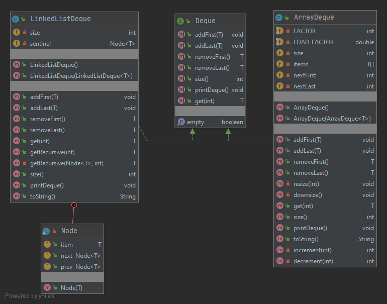

# [Project 1A: Data Structures](https://sp19.datastructur.es/materials/proj/proj1a/proj1a)

Create implementations of a “Double Ended Queue” using both lists and arrays. They have no capacity restrictions and allow null values.

## Run
Open in intellij IDEA & run the tests.DequeTest.java file.

## Class Diagram

## Files modified or created
- [Deque.java](src/Deque.java)
- [LinkedListDeque.java](src/LinkedListDeque.java)
- [ArrayDeque.java](src/ArrayDeque.java)
- [DequeTest.java](src/DequeTest.java)
- [ArrayDequeTest.java](src/ArrayDeque.java)
- [LinkedListDequeTest.java](src/LinkedListDequeTest.java)
- [TestUtility.java](src/TestUtility.java)

Note: The skeleton code came with one file, LinkedListDequeTest.java, which was completely rewritten to contain tests strictly for the [LinkedListDeque](src/LinkedListDeque.java) implementation. 

# Not included in the instructions, but I added
## Method Dependency Injection
Created a [Deque](src/Deque.java) interface that is implemented by [LinkedListDeque](src/LinkedListDeque.java) and [ArrayDeque](src/ArrayDeque.java). In [DequeTest](src/DequeTest.java), wrote methods that are dependent on the interface, rather than the implementations. Instances of the src.Deque implementations, i.e. [LinkedListDeque](src/LinkedListDeque.java) and [ArrayDeque](src/ArrayDeque.java), are injected into these methods via method dependency injection (a form of inversion of control). This made it possible to write one set of tests for both implementations.

## Performance
The get method in [LinkedList.java]((src/LinkedListDeque.java) determines if it is more efficient to traverse the list beginning from the front or the back by comparing the index to the size. If the index is in the first half of the list, it begins traversing from the front. If the index is in the back half of the list, it begins traversal from the back.

## Exceptions thrown under specific conditions. 
The constructors [ArrayDeque(ArrayDeque<T> other)](src/ArrayDeque.java) and [LinkedListDeque(LinkedListDeque<T> other)](src/LinkedListDeque.java) throw a NullPointerException if other is null. 

## Testing
Wrote tests such that 100% code coverage is achieved. 

The skeleton code supplied by the course came with one file, i.e. tests.LinkedListDequeTest.java, which came with several methods to test the implementations and several utility methods: checkEmpty, checkSize, and printTestStatus.  Almost all methods in it were replaced, except the aforementioned utility functions, which were moved to [TestUtility.java](src/TestUtilit.java).
