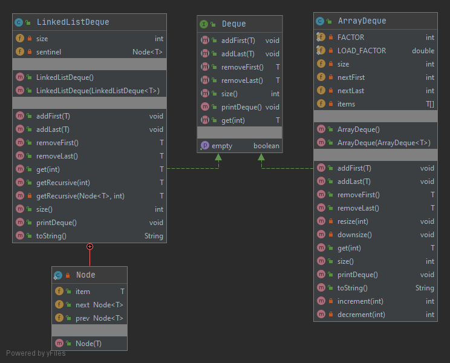

# [Project 1A: Data Structures](https://sp19.datastructur.es/materials/proj/proj1a/proj1a)

Create implementations of a “Double Ended Queue” using both lists and arrays. They have no capacity restrictions and allow null values. I added [Deque.java](src/Deque.java), which is implemented by both [LinkedListDeque.java](src/LinkedListDeque.java) and [ArrayDeque.java](src/ArrayDeque.java). I also added Junit5 testing for both of the implementations: [LinkedListDequeTest.java](tests/LinkedListDequeTest.java) and [ArrayDequeTest.java](tests/ArrayDequeTest.java).

## Run
Open in Intellij (I used Intellij IDEA 2020.1). 

To run a single test file, select the test file in the tests package, right click, and then select Run.

To run all tests: 
- Select Run | Edit Configuration from the main menu.
- In the Run/Debug Configurations dialog, click the Add New Configuration button on the toolbar or press Alt+Insert.
- Select JUnit from the list.
- A new configuration page opens. Name this configuration.
- From the Test kind list, select "All in package".
- In the Package field type "tests".
- Apply the changes and close the dialog.
- Select Run.

## Files modified or created
- [Deque.java](src/Deque.java)
- [LinkedListDeque.java](src/LinkedListDeque.java)
- [ArrayDeque.java](src/ArrayDeque.java)
- [ArrayDequeTest.java](tests/ArrayDequeTest.java)
- [LinkedListDequeTest.java](tests/LinkedListDequeTest.java)

## Class Diagram

# Not included in the instructions, but I added

## Testing

### Junit 5
@Nested test classes are used to express the relationship among several groups of tests.

@TestMethodOrder and @Order are used to configure the test method execution order for some test classes.

@TestInstance(TestInstance.Lifecycle.PER_CLASS) is used when test methods rely on state stored in instance variables - i.e. when the sequence of the tests are dependent upon each other. Otherwise, the default setting instantiates a new test instance per test method.

@DisplayName is used on test classes and test methods to declare custom display names.

@BeforeEach is used to execute methods before each test.

@BeforeAll is used to execute methods before all tests.

The skeleton code supplied by the course came with one file, i.e. TestLinkedListDeque.java, which has several methods to test the implementations and several utility methods: checkEmpty, checkSize, and printTestStatus.  This file was removed in favor of using Junit5.

### Code Coverage
Wrote tests such that all lines and branches are covered, except for the printDeque method, which simply calls the toString method, which is covered. 

## Performance
The get method in [LinkedList.java](src/LinkedListDeque.java) determines if it is more efficient to traverse the list 
beginning from the front or the back by comparing the index to the size. If the index is in the first half of the 
list, it begins traversing from the front. If the index is in the back half of the list, it begins traversal from the 
back. Note: this does not change the Big-O of this method - it is still O(N). 

## Exceptions thrown under specific conditions. 
The constructors [ArrayDeque(ArrayDeque<T> other)](src/ArrayDeque.java) and [LinkedListDeque(LinkedListDeque<T> other)](src/LinkedListDeque.java) throw a NullPointerException if other is null. 
