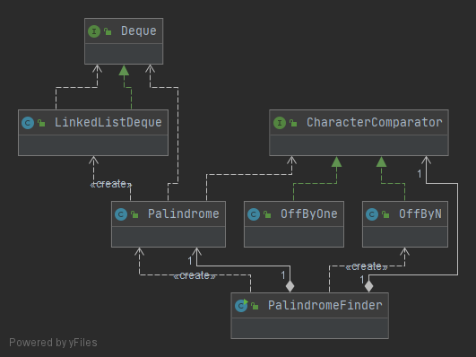
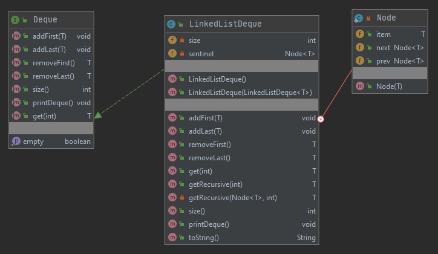
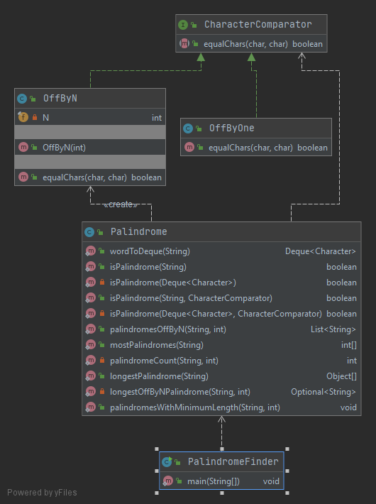

# [Project 1B: Applying & Testing Data Structures version 1.0](https://sp19.datastructur.es/materials/proj/proj1b/proj1b)

Determine if a word is a palindrome. The [LinkedListDeque](src/LinkedListDeque.java) that I implemented in project 1a is used to represent a word. 

The skeleton files supplied for the course prohibited the use of dependency injection, so there is high coupling, as methods instatiate objects.

Test Driven Development was used to complete this assignment. 

## Run
Open in Intellij (I used Intellij IDEA 2020.1). 

To run the [PalindromeFinder](src/PalindromeFinder.java), select it in the src package, right-click, and then select run. 

To run a single test file, select the test file in the tests package, right click, and then select Run.

To run all tests: 
- Select Run | Edit Configuration from the main menu.
- In the Run/Debug Configurations dialog, click the Add New Configuration button on the toolbar or press Alt+Insert.
- Select JUnit from the list.
- A new configuration page opens. Name this configuration.
- From the Test kind list, select "All in package".
- In the Package field type "tests".
- Apply the changes and close the dialog.

## Class Diagram

All Classes:

[LinkedListDeque.java](src/LinkedListDeque.java) and [Deque.java](src/Deque.java) with all members and constructors visible:

Evertying except for the deques with all members and constructors visible:

## Tasks
- Create a [Deque](src/Deque.java) interface that contains all of the methods that appear in both ArrayDeque and - [LinkedListDeque](src/LinkedListDeque.java)
 (I already did this in project 1a).

- Create a [Palindrome](src/Palindrome.java) class that is used to create a [Deque](src/Deque.java) representation of a word and to check if a word is a palindrome. 

- Create a class called [OffByOne](src/OffByOne.java) that implements the [CharacterComparator](src/CharacterComparator.java) interface. [OffByOne](src/OffByOne.java) is used to determine if the difference between two 
chars is one (e.g, 'b'-'a' = 1). 

- Create a class called [OffByN](src/OffByN.java) that implements the [CharacterComparator](src/CharacterComparator.java) interface, where N is the difference between to chars (e.g, 'e'-'a' = 4, where N is 4). 

- Create the class called [PalindromeFinder](src/PalindromeFinder.java) that finds the most palindromes
in the file library-sp19/data/words.txt for all values of N and the longest palindrome in the words.txt.

## Files modified or created
- [Deque.java](src/Deque.java)
- [LinkedListDeque.java](src/LinkedListDeque.java)
- [Palindrome.java](src/Palindrome.java)
- [OffByOne.java](src/OffByOne.java)
- [OffByN.java](src/OffByN.java)
- [PalindromeFinder.java](src/PalindromeFinder.java)

- [TestPalindrome.java](tests/TestPalindrome.java)
- [TestOffByOne.java](tests/TestOffByOne.java)
- [TestOffByN.java](tests/TestOffByN.java)
