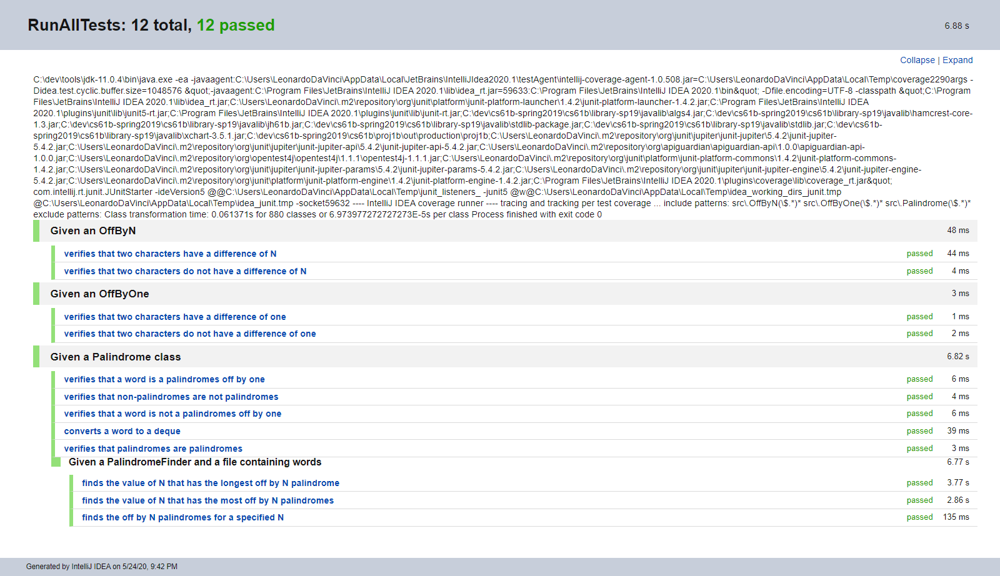
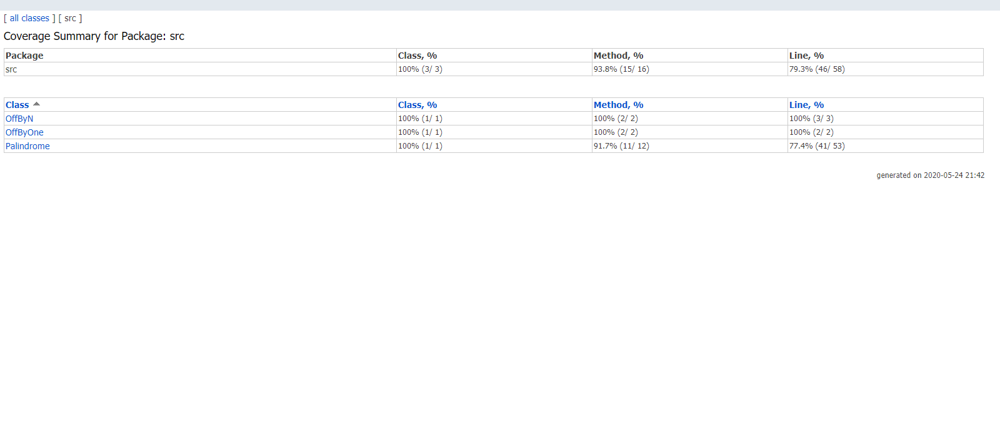

# [Project 1B: Applying & Testing Data Structures version 1.0](https://sp19.datastructur.es/materials/proj/proj1b/proj1b)

Determines if a word is a palindrome & performs other functions related to palindromes: lists offByN palindromes for 
specified N; determines what offByN value has the most palindromes; finds the longest palindrome in a file for any 
offByN value; and prints the palindromes with the specified minimum length.

A palindrome is a word that is the same whether it is read forwards or backwards. An offByN palindrome is a palindrome 
whose first and last characters have a difference of N, whose second and second to last characters have a difference of 
N, and so on.

The file, containing the words, is read as a stream. To find the palindromes, the words are filtered using the 
CharacterComparator functional interface and lambda expressions. To implement the other methods, method references and 
aggregate functions such as max, count, and collect(Collectors.toList()) are used.

In [project1a](https://github.com/g-esco101/cs61b/tree/master/proj1a) I implemented two deques:
a [LinkedListDeque](src/LinkedListDeque.java) and an  
[ArrayDeque](https://github.com/g-esco101/cs61b/blob/master/proj1a/src/ArrayDeque.java). In this project, we select
the LinkedListDeque to represent the words, because it is expected to be slightly faster since the array based 
implementation must resize. Junit tests for these deques can be found 
[here](https://github.com/g-esco101/cs61b/tree/master/proj1a/tests). Also, in 
[project1gold](https://github.com/g-esco101/cs61b/tree/master/proj1gold), I implemented randomized testing for a deque
that can be found [here](https://github.com/g-esco101/cs61b/blob/master/proj1gold/src/TestArrayDequeGold.java).

Test Driven Development was used to complete this project. 

## Run

Open in Intellij (I used Intellij IDEA 2020.1). 

To run the [PalindromeFinder](src/PalindromeFinder.java), select it in the src package, right-click, and then select run. 

To run a single test file, select the test file in the tests package, right click, and then select Run.

To run all tests: 
- Select Run | Edit Configuration from the main menu.
- In the Run/Debug Configurations dialog, click the Add New Configuration button on the toolbar or press Alt+Insert.
- Select JUnit from the list.
- A new configuration page opens. Name this configuration.
- From the Test kind list, select "All in package".
- In the Package field type "tests".
- Apply the changes and close the dialog.
- Select Run

## Files modified or created

- [Deque.java](src/Deque.java)
- [LinkedListDeque.java](src/LinkedListDeque.java)
- [Palindrome.java](src/Palindrome.java)
- [OffByOne.java](src/OffByOne.java)
- [OffByN.java](src/OffByN.java)
- [PalindromeFinder.java](src/PalindromeFinder.java)

- [TestPalindrome.java](tests/TestPalindrome.java)
- [TestOffByOne.java](tests/TestOffByOne.java)
- [TestOffByN.java](tests/TestOffByN.java)

## Class Diagrams

All Classes:

[LinkedListDeque.java](src/LinkedListDeque.java) and [Deque.java](src/Deque.java) with all members and constructors visible:

All classes except for the deques with all members and constructors visible:

## Testing

### Junit 5

@Nested test classes are used to express the relationship among several groups of tests.

@TestInstance(TestInstance.Lifecycle.PER_CLASS) is used when test methods rely on state stored in instance variables - i.e. when the sequence of the tests are dependent upon each other. Otherwise, the default setting instantiates a new test instance per test method.

@DisplayName is used on test classes and test methods to declare custom display names.

@BeforeEach is used to execute methods before each test.

### Code Coverage
Wrote tests such that all lines and branches are covered, except for the printDeque method, which simply calls the toString method, which is covered. 

## Tasks

- Create a [Deque](src/Deque.java) interface that contains all of the methods that appear in both ArrayDeque and - [LinkedListDeque](src/LinkedListDeque.java)
 (I already did this in project 1a).

- Create a [Palindrome](src/Palindrome.java) class that is used to create a [Deque](src/Deque.java) representation of a word and to check if a word is a palindrome. 

- Create a class called [OffByOne](src/OffByOne.java) that implements the [CharacterComparator](src/CharacterComparator.java) interface. [OffByOne](src/OffByOne.java) is used to determine if the difference between two 
chars is one (e.g, 'b'-'a' = 1). 

- Create a class called [OffByN](src/OffByN.java) that implements the [CharacterComparator](src/CharacterComparator.java) interface, where N is the difference between to chars (e.g, 'e'-'a' = 4, where N is 4). 

- Create the class called [PalindromeFinder](src/PalindromeFinder.java) that finds the most palindromes
in the file library-sp19/data/words.txt for all values of N and the longest palindrome in the words.txt.

