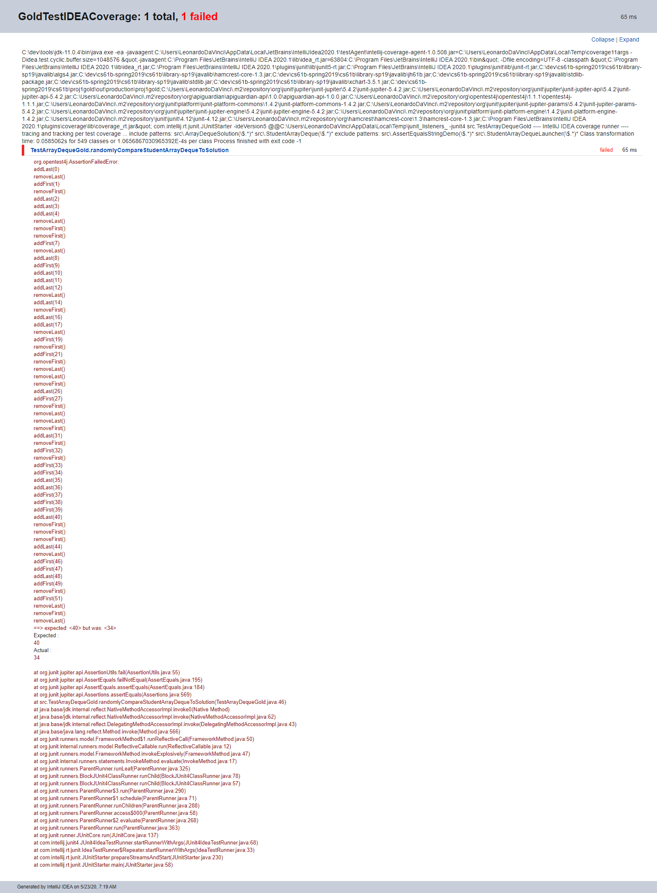
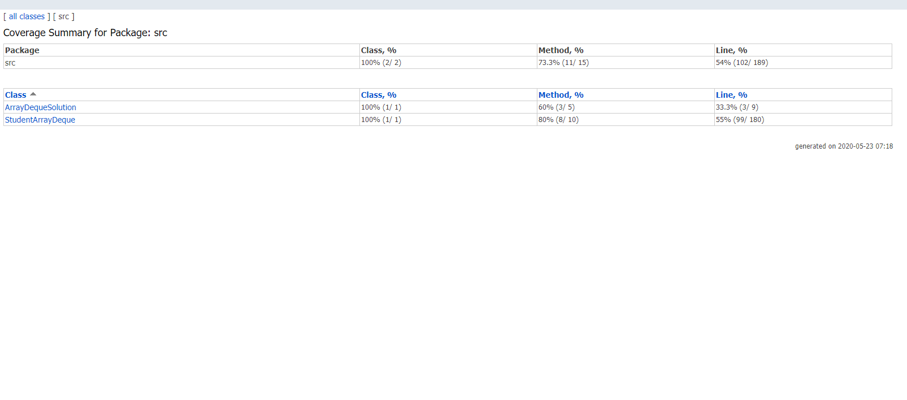

# [Project 1 Gold: Autograding](https://sp19.datastructur.es/materials/proj/proj1gold/proj1gold)

Concerns randomized testing and Junit testing (I used Junit5). 

Create an autograder that invokes the same methods randomly on a student's implementation of an ArrayDeque
and on the solution, and compares the results by using assertions. The goal is to write uniformly random tests to find bugs 
and invoke assertions immediately. Another goal is to construct a message with a strict format (as seen in my Junit
report) to be included in the junit report.
[StringJoiner](https://docs.oracle.com/javase/8/docs/api/java/util/StringJoiner.html) offers a simple way to do this task. 
It is used to easily create a sequence of characters seperated by a delimiter with an option to add characters at each end, the prefix and the suffix.

I spent quite some time reading through the [junit5](https://junit.org/junit5/docs/current/user-guide/#writing-tests-test-instance-lifecycle)
	and becoming familiar with what it has to offer. 

The instructions state to implement it in one method, but does not cover the importance of this in regard to Junit. 
Junit instantiates a new test class for each test method, so any instance variables will be reset. This can avoided
by using the @Before or the @BeforeEach annotations in junit4 and junit5, respectively. Another option is to change
this default setting to instantiate an new instance of a class "per-class" by using ths annotation 
@TestInstance(Lifecycle.PER_CLASS) at the class level. The purpose of the "per-method" lifecycle is to allow
individual test methods to be executed in isolation and to avoid any unforeseen behavior due to mutable test 
instance state.

The skeleton code came with all classes in a single package that I reorganized into several packages.

## Run

Open in Intellij (I use Intellij IDEA 2020.1). 

Run [TestArrayDequeGold.java](proj1gold/TestArrayDequeGold.java ) by selecting it in the src package, right click, and then select Run

## Files created or modified
- [TestArrayDequeGold.java](proj1gold/TestArrayDequeGold.java )

## Test Reports

Junit5 report shows the desired output: a stacktrace with each method invocation on a new line. This was attained by using 
a [StringJoiner](https://docs.oracle.com/javase/8/docs/api/java/util/StringJoiner.html).

Code coverage of the randomized tests.

